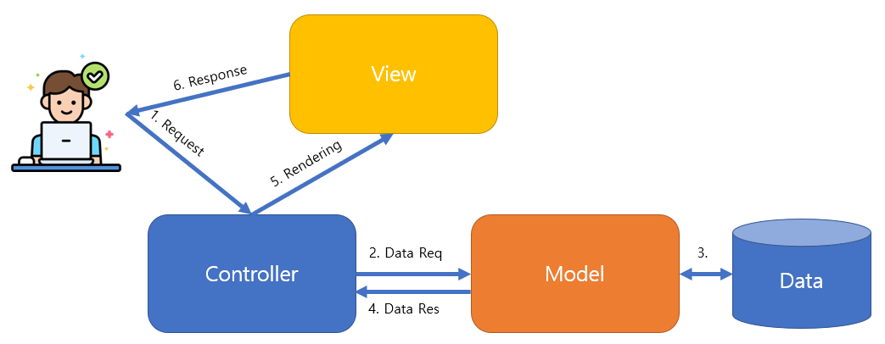

# iot-webapp-2025

<p>IoT 개발자 과정 <a href="https://dotnet.microsoft.com/ko-kr/apps/aspnet" target="_blank" style="color:red;">ASP.NET Core</a> 학습 리포지토리</p>

## 1일차

### Web
- 인터넷 상에 사용되는 서비스 중 하나
- 웹을 표현하는 기술 : HTML(Hyper Text Markup Language). XML(eXtensable Markup Language)의 경량화 버전
- 2014년 이후 HTML5로 적용되고 있음

#### 웹 기술
- 웹 표준기술(프론트엔드) : HTML 5(웹 페이지 구조) + CSS 3(디자인) + JavaScript (인터렉티브)
- 웹 `서버`기술(백엔드) : ASP.NET Core(C#|VB), SpringBoot(Java), Flask|dJango(Python), CGI(PHP,C), Ruby, ...
- 웹 서비스 : 프론트엔드 + 백엔드
- 웹 브라우저 상에서 동작 : 현재는 웹 브라우저 상에서만 동작하는 경계가 사라졌음 

#### HTML 5
- 웹 페이지를 구성하는 언어(근간, 기본)
- HTML 상에서도 디자인을 할 수 있으나, 현재는 CSS로 분리

#### CSS 3
- Cascading Style Sheet : 객체지향에 사용되는 부모자식관계로 디자인 하는 기술
- 아주 쉬운 문법으로 구성됨

#### JavaScript 
- 표준명 ECMAScript 2024.
- Java와 전혀 관계없음. Java의 문법을 차용해서 사용한 웹 스크립트 언어
- 엄청난 발전을 이뤄 여러가지 기술로 분리
    - React.js, View.js 등의 프론트엔드 기술 언어로 분파
    - Node.js와 같은 웹 서버기술에도 적용
    - VS Code(아톰에디터 기반) 같은 개발도구를 만드는데도 사용
    - 3D 게임, 모바일 개발 등 다양한 분야에 사용

#### 웹 서버기술
- `ASP.NET Core` : C#/VB언어도 웹 서버를 개발
- SpringBoot, Flask 등 다른 언어로 웹 서버를 개발해도 무방

#### 왜 웹을 공부해야하나?
- 스마트팩토리 솔루션을 대부분 웹으로 개발(사용범위 제약을 없애기 위해서)
    - 웹 사이트, 일부분 모바일 앱 동시 개발
- 스마트홈(IoT), ERP, 병원예약, 호텔예약, 인터넷뱅킹, 온라인서점 ... 
- 모든 IT/ICT 개발에 웹 기술은 포함되어 있음

#### HTTP
- HyterText Transfer Protocol
- 웹을 요청/응답하는 프로토콜
- HTTPs : HTTP with secure. 보안을 강화한 HTTP 프로토콜

### 웹 표준기술 - HTML

#### VS Code 확장설치
- Live Server

#### HTML 구조
- [소스](./day01/html01.html)
- html 태그 내에 head, body로 구성(무조건!)
- README.md에도 HTML 태그를 그대로 사용가능(heading은 적용안됨)
- VS Code에서 html:5 자동생성
- [소스](./day01/html02.html), [소스](./day01/html03.html)
- CSS가 소스라인을 많이 사용. css는 외부스타일로 분리 사용
- JS도 소스라인이 매우 김. JS도 외부스크립트로 분리 사용
- 웹 브라우저의 개발자모드(F12)로 디버깅을 하는 것이 일반적

#### HTML 기본태그(body에 사용)
- [소스](./day01/html04.html)
- h1 ~ h6 : 제목글자
- p, br, hr : 본문, 한줄내려가기, 가로줄
- a : 링크
- b/strong, i, small, sub, sup, ins/u, del : 굵은체, 이탤릭체, 작은글씨, 아래첨자, 위첨자...
- ul/ol, li : 동그라미목록/순번목록, 목록아이템
- table, tr, th, td : 테이블, 테이블로, 테이블헤더, 테이블컬럼
- img, audio, video : 이미지, 오디오, 비디오 
- [소스](./day01/html05.html), [소스](./day01/html06.html)
- form, input, button, select, textarea, label : 입력양식, 텍스트박스, 버튼, 콤보박스, 여러줄텍스트박스, 라벨
- progress : 진행률
- div, span : 공간분할

#### 공간분할태그
- [소스](./day01/html07.html)
- div 사용 이전엔 table, tr, td로 화면 분할을 활용
- table을 여러번 중복하면 렌더링속도 저하로 화면이 빨리 표시가 안됨
- 웹 기술표준을 적용해서 div 태그로 공간분할을 시작
- div를 CSS로 디자인 적용해서 렌더링속도를 빠르게 변경
- 게시판 목록, 상세보기 등에서는 아직도 table을 사용 중

#### 시맨틱웹
- 웹구조를 좀더 구조적으로 세밀하게 구분짓는 의미로 만들어진 웹 구성방식
- 시맨틱 태그
    - header, nav, main, section, aside, article, footer 등
    - 기본 HTML 태그가 아니고, 필수도 아님
- 최근에는 잘 사용안함. div태그에 id로 부여해서 유사하게 사용 중
- div만 잘 쓰면 됨

### 웹 표준기술 - CSS

#### 개요
- 마크업 언어에 표시방법을 기술하는 종속형 시트(계단식 스타일시트)
- WPF는 CSS와 유사한 방식을 차용
- 문법
    ```css
    태그/아이디/클래스 {
        /* key: value를 반복*/
        key: value; /* C++ 주석 // 한줄 주석은 안됨 */
    }
    ```
- html 태그 속성
    - id : 웹페이지 하나당 한번만 쓸것
    - class : 여러번, 여러개 사용가능

- UI기술로 많은 분야에서 사용
    - Qt, PyQt, Electron, Flutter(모바일), React Native(모바일), React.js, ...
- [소스](./day01/html08.html)

## 2일차

### 웹 표준기술 - CSS
- HTML, CSS, JS 동일하게 "(쌍따옴표), '(홑따옴표) 동시 사용가능
- Python은 ''를 추천, 웹은 ""를 추천
- 스타일부터 레이아웃까지 연습
- [소스](./day02/html04.html)

### 웹 표준기술 - JavaScript
- Java(컴파일러언어)와 아무런 관계없음
- JavaScript(스크립트언어)
- [소스](./day02/html05.html)

#### 기본문법
- HTML내에 script 태그 내에 작성
- 변수 선언이 var(전역,지역), let(지역)
- 문장 끝에 ; 생략이 가능하지만 되도록 사용할 것
- 키워드

    

- 화면메시지박스 : alert()
- 디버깅 출력 : console.log()

    ```js
    <script>
        // 변수 선언
        var radius = 10;
        var PI = 3.14159265;

        // 출력
        alert(2 * radius * PI);
        console.log(2 * radius * PI);
        // 개발자도구 > 소스에서 디버깅가능
        // VisualStudio와 동일
    </script>    
    ```
- 변수타입 : 숫자, 문자열, 불린, ... 
    - null : undefined
- 연산자 : 비교연산자, 수식연산자, 논리연산자, ...
    - 차이점 : === (타입과 값이 완전일치)
- 흐름제어 : if, for, while 
- 함수 : function 함수명
    - 익명함수 function() {}
- 거의 대부분 C문법과 동일

#### JavaScript 객체
- [소스](./day02/html06.html)
- JSON : 자바스크립트 객체를 표현하는 방식
- 매우 편리하여 표준으로 지정하고 모든 IT분야에서 사용 중

    ```js
    var json_data = {
        key1: value1,
        key2: value2,
        method: function() {
            // ...
        },
    }
    ```

#### DOM
- [소스](./day02/html07.html)
- Document Object Model : HTML 문서의 구조를 JS에서 접근할 수 있는 개념
- HTML 태그를 JS로 조작한다는 의미
- JS에서 가장 중요한 부분 - 전통적인 JS 처리방식(구닥다리)
- DOM에서 쓰이는 주요 함수들

    ```js
    // 1개 선택
    document.querySelector(선택자);
    document.getElementById(아이디);
    // 다중 선택
    document.querySelectorAll(선택자); // for문으로 후처리
    document.getElementsByName(이름);
    document.getElementsByClassName(클래스);

    // 객체변수
    var obj = document.getElementById("container");
    obj.style.backgroundColor = 'red';
    obj.style.color = 'blue';
    obj.innerHTML = "변경 문자열";
    obj.getAttribute("속성");
    obj.setAttribute("속성", 변경할값);

    window.onload = function(event) {
        // ...
    }
    ```

#### jQuery
- JavaScript DOM의 복잡한 사용법을 개선하고 만든 라이브러리
- 2006년도 개발, 2023년까지 업데이트
- https://jquery.com/
- CDN 방식으로 사용
    ```html
    <script src="https://code.jquery.com/jquery-3.7.1.min.js" integrity="sha256-/JqT3SQfawRcv/BIHPThkBvs0OEvtFFmqPF/lYI/Cxo=" crossorigin="anonymous"></script>
    ```
- 모든 DOM 객체에 접근할때 `$(선택자|아이디|클래스)` 로 처리
- jQuery on('이벤트', function() {}) 또는 이벤트(function () {})

    

- [소스](./day02/html09.html)

#### Vanilla JS
- 순수 JS로 불리며 jQuery처럼 CDN링크가 필요없음
- 전통적 방식보다 효율적으로 변경됨
- 새로 개발되는 웹사이트는 Vanilla JS를 사용

## 3일차

### 반응형웹
- UTF-8 적용 전 : 한국어웹, 영어웹, 일본어웹 등 웹페이지를 언어별로 개발필요
- 반응형 웹 이전 : PC용, 모바일용, 태블릿용 등 웹사이트 다중 개발필요
- 문제 : 하나의 웹페이지가 수정되면 다른 웹페이지들도 다 수정 -> 시간, 돈의 Loss
- 하나의 웹페이지로 기기, 언어문제를 전부 해결하고자 나온 기술중 화면쪽 -> 반응협웹
- `Responsive Web` : 웹, 모바일 등의 기기와 해상도에 상관없이 하나의 웹으로 모두 표현할 수 있는 웹화면 개발 기술

- HTML5에 반응형 웹 메타태그만 사용

    ```html
    <!DOCTYPE html>
    ...
    <head>
    <!-- 반응형웹 중요태그 -->
    <meta name="viewport" content="width=device-width, initial-scale=1.0">
    ```

- 부트스트랩으로 학습
- https://inpa.tistory.com/category/Style%20Sheet/Bootstrap5?page=2 

### 부트스트랩
- 현재 전세계적으로 가장 많이 사용되는 오픈소스 CSS, JS 프레임워크
- 트위터 블루프린트로 시작. 트위터 웹사이트를 꾸미기위해서 개발시작
- 현재 5.3 버전
- 이전에는 jQuery 사용했으나 현재는 Pure JS로 전향되었음
- [공식사이트](https://getbootstrap.com/)

#### 부트스트랩 시작
- [시작](https://getbootstrap.com/docs/5.3/getting-started/introduction/)
- GetStarted에 나와있는 CSS와 JS를 웹페이지에 붙여넣기

    

#### 부트스트랩 학습
- 버튼 사용법

    

- 미디어쿼리 : 웹페이지 사이즈에 따른 사용법을 위해 필요
    - Bootstrap에서 sm, md, lg 등의 infix를 사용할 경우가 많음  
    - X-Small : None(사용할 이름없음) (< 576px)
    - Small : sm (>= 576px)
    - Medium : md (>= 768px)
    - Large : lg (>= 992px)
    - Extra large : xl (>= 1200px)
    - Extra extra large : xxl (>= 1400px)

- 컨테이너 : 기본 레이아웃에서 가장 중요! 그리드 스타일이라고 부름
    - container - 일반적인 넓이사용. 양쪽에 여백이 존재
    - container-fluid - 여백없이 웹페이지를 꽉채우는 스타일
    - container > row > col 형식으로 사용
    - 각 grid는 최대 12개까지 사용

- 정렬 클래스
    - * : start, center, end
    - text-*
    - align-items-*
    - align-self-*
    - justify-content-*

- 거터 : 갭(안쪽여백), padding과 동일
    - g, gx, gy, g-number, gx-number, gy-number
    - number : 1부터 5까지 사용가능
    - g : gx + gy
    - gx : 왼쪽, 오른쪽 안여백
    - gy : 위쪽, 아래쪽 안여백

- 여백을 위한 클래스
    - -number포함 : 1~5까지
    - p, ps, pt, pb, pe, px, py : padding
    - m, ms(left), mt, mb, me(right), mx, my : margin
    - start, top, end, bottom : 배율로 조정

- 컴포넌트 학습
    - Accordion
    - Alert : Button 클래스와 동일 primary ~ light(link는 없음)
    - Breadcrumb : 메뉴 경로
    - Navbar, Navs & tabs : 메뉴 내비게이션바
    - Button, Close button, Button group : 버튼관련 컴포넌트
    - Card, Placeholders, Modal, `Popovers`, Toasts, `Tooltips` : 화면 영역 컴포넌트
    - Pagination : 게시판 페이지 컴포넌트
    - Progress, Spinners : 프로그레스바, 대기용 컴포넌트
    - Carousel : 이미지 갤러리

    

- 아이콘
    - [사이트](https://icons.getbootstrap.com/)
    - 부트스트랩이 지원해주는 아이콘
    - Python PyQt, leaflet.js(Folium) 등에도 사용가능
    - FontAwesome, XEIcon, Google Icon Fonts

#### 이미지팁
- 화면 UI 설계시 이미지 찾는 시간을 절약하기 위해 만든 사이트
- placehold image Site
    - [플레이스홀드](https://placehold.co/)
    - [로렙플릭커](https://loremflickr.com/)
    - [로렘픽섬](https://picsum.photos/)(추천)

#### 부트스트랩 템플릿 사이트
- 유료 템플릿
    - https://wrapbootstrap.com/templates 
    - https://themeforest.net/search/sns%20bootstrap : 필요한 소스코드도 구매가능
    - https://themewagon.com/theme-price/pro/
    - https://themes.getbootstrap.com/ 부트스트랩 공식 유료템플릿
- 무료 템플릿
    - https://startbootstrap.com/ : 무표 템플릿 중 최고
    - https://bootswatch.com/
    - https://bootstrapmade.com/ : 출처를 표기해야 함
    - https://themewagon.com/theme-price/free/
    - https://graygrids.com/templates/tag/bootstrap-5?type=free

### 프론트엔드 활용
- HTML5 + CSS3 + JS + BootStrap 응용예제
    - Bootstrap Image Gallery

    https://github.com/user-attachments/assets/fd0f5d4a-a8b7-4c84-bbad-cd682d40f5c0

    
## 4일차

### 프론트엔드 활용
- HTML5 + CC3 + JS 응용예제
- Modern Business 템플릿 클로닝
    - https://startbootstrap.com/template/modern-business 

    

    - 압축파일 다운로드 후 압축해제

#### HTML5 Responsive Web template 
- https://html5up.net/

#### Modern Business 클로닝
1. 모든 웹페이지 시작은 index.* (.html, .asp, .jsp, .cshtml...)
2. 폴더 구성 : css, js, assets
3. favicon.ico 구성
4. Bootstrap 다운로드 후 폴더에 구성(not CDN)
    - bootstrap-5.3.6-dist.zip
5. Bootstrap Icon 링크 클릭 다운로드
    - https://github.com/twbs/icons/releases/tag/v1.13.1
    - bootstrap-icons-1.13.1.zip
    - css 폴더 아래 fonts 폴더 생성
    - bootstrap-icons.woff, bootstrap-icons.woff2 붙여넣기
6. body 마지막 Bootstrap js 링크 추가
7. body 내의 태그영역으로 나눠서 클로닝
    - div, main
        - div, nav
        - div, header
        - div, feature
        - div, testimonial
        - div, blog_section
    - div, footer
8. 태그 내에 Bootstrap 클래스 적용
9. Bootstrap Example의 테마 적용
10. 전체화면

    https://github.com/user-attachments/assets/d205515e-3edc-4a2a-a538-a08137dad2b1

### 5일차

### 웹개발 기술 용어
- SPA : Single Page Applicaiton. 페이지를 이동해도 새로고침 없이 한페이지에서 작동하는 웹
- MPA : Multi Page Applicaiton. 전통적인 여러페이지로 작동하는 웹
- CSR : Client-Side Rendering. 대부분의 SPA가 동작하는 방식. 렌더링을 브라우저에서 처리
- SSR : Server-Side Rendering. MPA가 위주. HTML을 서버에서 생성후 전달(naver, google 등 포털)

### ASP.NET Core 
- ASP : Active Server Page. Classic ASP라고 부름. 동적인 웹페이지를 만드는 기술
- 프론트엔드(HTML + CSS + JS) 상에서 동작하는 기술을 동적 웹페이지라고 부르지 않음
- 동적 웹페이지 : 사용자가 웹서버에 요청을 해서 값이 변경되는 것

    

- IIS : Internet Information Service. MS가 윈도우 운영체제에 포함시킨 `웹 서버`
    - 윈도우 프로그램 추가 제거(appwiz.cpl)
    - 윈도우 기능 켜기/끄기 > 인터넷 정보 서비스 클릭 후 확인

- 윈도우 설정은 일반 사용자용, 제어판은 개발자용
    - 제어판 > Windows Tools > IIS(인터넷 정보 서비스) 관리자
    
    

- Java가 1995년 출현하면서 Classic ASP, Classic VB 등의 옛날 MS기술이 위협
- 2000년 초반에 .NET 프레임워크를 출시
    - C#, VB(.NET) 새로운 언어 들이 포함됨
    - 위의 언어들로 개발할 수 있는 웹 기술인 ASP.NET 등장
    - 이후 언어는 계속 발전
    - 2016년에 크로스플랫폼 ASP.NET Core
    - 2020년에 .NET Framework(Windows전용)을 .NET 5.0(크로스플랫폼)로 변경

#### ASP.NET Core 장점
- 빠르다 : 초창기 ASP.NET은 C#으로 Winforms 만드는 것처럼 개발(개발생산성은 좋지만 렌더링 속도가 무지하게 느렸음). MVC모델로 분리하면서 윈폼식 개발을 제거
- 오픈소스 : Java JSP/Spring, Python Flask 등이 오픈소스로 발전하니까 MS도 오픈소스 전향
- 크로스플랫폼 : Windows에서만 동작하던 걸, MacOS, Linux 등으로 확대시킴
- 종속성 주입 : Dependencty Injection. Spring 쪽에 특화되던 기술을 접목해옴. 개발시간 절약
- 개발용 웹서버 : IIS가 Visual Studio에 포함. 웹서버 설정을 할 필요가 없음
- 클라우드 친화적 : MS Azure 등의 클라우드와 연계가 쉬움
- MVC 모델 : Model View Controller를 따로 개발. Spring Boot도 동일
- 최적화가 잘 되어 있음

#### ASP.NET Core 활용처
- `웹 사이트` 개발 : 기본적인 내용
- `풀스택` 개발 : 프론트엔드(React, Vue, Angular js) + 백엔드(ASP.NET Core)
- `API 서버` 개발 : TMDB 영화 데이터 조회 API, Youtube API, 데이터포털 API 등의 데이터만 주고받는 서비스 개발
- 도메인특화 솔루션 개발 : MES, ERP, SmartFactory, SmartShip 등
- 이커머스 개발 : 쇼핑몰, 온라인 서점, 여행예매 사이트 등

#### ASP.NET Core 시작
1. Visual Studio 시작 > 새 프로젝트 만들기
2. ASP.NET Core 웹앱(Model-View-Controller) 선택
3. 프로젝트 이름, 위치, 솔루션 이름 입력 
4. 추가정보
    - HTTPS : 보안 인증서를 신청, 다운로드 설정을 해야 함. 복잡, 체크해제
    - 최상위 문 사용 안함 만 체크 
5. 빌드 후 실행 
6. properties > launchSetting.json 에서 자신의 포트번호 확인
7. 기본 ASP.NET Core 웹앱에 포함된 프론트엔드 라이브러리
    - Bootstrap 5.1.0
    - jQuery 3.6.0
    - 최신버전으로 변경하고 싶으면 다운로드 받아서 구성하면 됨
    - 경로 - \wwwroot\lib\bootstrap\dist

#### ASP.NET Core 프로젝트 구조
- Properties > launchSettings.json - 웹서버 실행 설정
- wwwroot - 정적 리소스 구성한 폴더
    - css : 웹페이지 추가적인 css
    - js : 웹페이지 추가적인 js
    - lib : Bootstrap, jQuery 등의 라이브러리 포함된 폴더
    - favicon.ico : 웹페이지 대표 아이콘
- 종속성 : .NET 관련 NuGet 패키지 라이브러리(종속성)
- Controllers : MVC 패턴 중 Controller 관리
    - HomeController : Controller postfix는 제거하고 호출. Views에 postfix를 제거한 폴더 존재    
    - 메서드 : 메서드 이름과 동일한 cshtml이 존재
    - 비즈니스 로직이 포함
- Models : MVC 중 Model
    - 데이터, DB관련된 소스 포함
- Views : MVC 중 View 역할
    - Controller에 포함된 클래스와 동일한 이름의 폴더, cshtml이 존재
    - cshtml : HTML + ASP.NET 기술이 포함된 웹페이지
        - @, asp-append-version, asp-controller, asp-action 등의 속성
    - _Layout.cshtml : 전체 HTML 틀을 구성. @RenderBody()에서 표현
    - 웹사이트는 중간 content 이외는 모양이 항상 동일
    - cshtml 중 _로 시작하는 파일은 여러번 공유하겠다는 뜻
- appsettings.json : 로그 등 애플리케이션 설정
- Program.cs : C# 프로그램 시작점. 실제 웹앱이 시작될 때 필요한 초기화 담당
    - 중요 소스

    ```cs
    // ...
    app.UseStaticFiles();   // 정적인 HTML,CSS,JS를 사용하겠다
    app.UseRouting();       // 라우팅으로 URL을 사용하겠다
    app.UseAuthorization(); // 권한 설정을 사용하겠다
    // http://localhost:port/Home/Index/2 와 같이 URL을 사용하겠다
    // RESTful URL -> Rest API를 위한 요소 중 하나
    // Program.cs 에서 중요한 파트
    // controller의 Home, action의 Index는 Default값
    app.MapControllerRoute(name: "default", pattern: "{controller=Home}/{action=Index}/{id?}");
    // ...
    ```

#### ASP.NET Core 페이지 생성법
1. 기존 Controller가 존재할 때
    - cshtml에 asp-controller, asp-action 속성 추가
    - Controller에 asp-action의 속성값과 동일한 메서드 추가
    - Views 폴더에 같은 이름의 cshtml을 생성, 작성

2. Controller가 없을때 1
    - Controllers 폴더에서 컨트롤러 생성
    - MVC 컨트롤러 - 비어있음 선택
    - SideController 클래스 생성
    - Index() 메서드에서 오른쪽 버튼 뷰 추가 선택
    - Razor 뷰 - 비어있음 선택
    - Index.cshtml 생성 후 작성

3. **Controller가 없을때 2**
    - `EntityFramework 사용하여 뷰가 포함된 MVC 컨트롤러` 또는 `읽기/쓰기 동작이 포함된 컨트롤러` 중 선택
    - BoardController 클래스 생성

        

    - 메서드 Index() 부터 Delete() 까지 총 8개 메서드 생성
    - Models 폴더에서 모델 Board.cs 추가
    - 인덱스 마다 뷰 추가. Razor 뷰 선택(Razor 뷰 - 비어있음 아님!)

        

        

        - 템플릿 : Create, Delete, Details, List, Edit (DB의 CRUD와 매핑)
        - 모델 클래스 : MVC, MVVN에서 Model 클래스가 포함되어야 함 (DB 설정이 필요)

    - Razor 뷰 선택
    - Index.cshtml 생성
    - _Layout.cshtml 에 내비게이션 메뉴 추가

#### ASP.NET Core MVC



- MVVM과 MVC 패턴의 구조에대 설명할 수 있어야 함!
- 현재 기본적인 웹개발의 표준. Java도 Spring Boot MVC
- 프론트엔드가 심각한 스파게티 코드였으면 현재는 최소화하고 있음
- Razor 구문 : @로 시작하는 C# 문법에 대한 이해

- DB 연동방법
    - 전통적인 방법 : WPF나 윈앱에서 연동방법. SQL쿼리문을 직접 작성, 실행
    - 현대적인 방법 : EntityFramework 방식. 쿼리를 사용하지 않음
        - DB First : DB를 설계해 놓고, 연결, 사용하는 방식
        - Code First : 모델 클래스만 만들어 놓고, EF가 DB에 테이블을 자동 생성


#### ASP.NET Core MVC - Kelly Portfolio 디자인 클로닝
1. Kelly-1.0.0.zip 다운로드
2. 정적파일 분석
3. index.html 오픈, VS Views > Shared > _Layout.cshtml 디자인 태그 옮기기
4. wwwroot 내 vendor 에서 Bootstrap 관련 폴더삭제   
    - php 관련도 추후 삭제 필요
5. _Layout.cshtml 작업

    

## 5일차

### ASP.NET Core

#### ASP.NET Core MVC - Kelly Portfolio 디자인 클로닝(계속)
1. to be continued...
